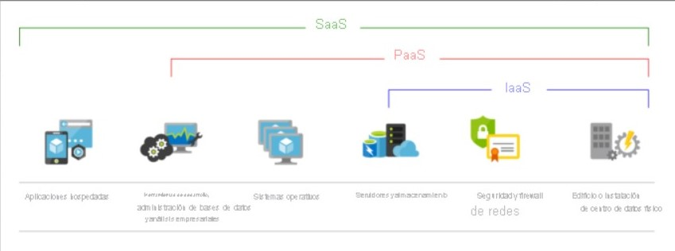
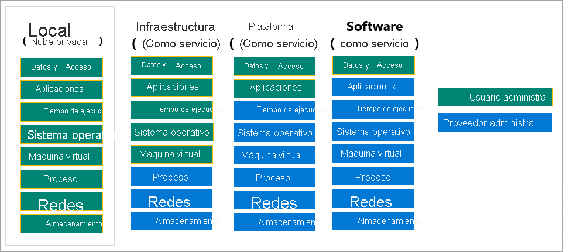
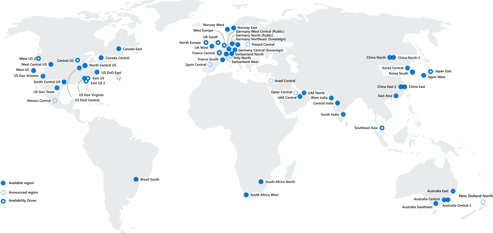
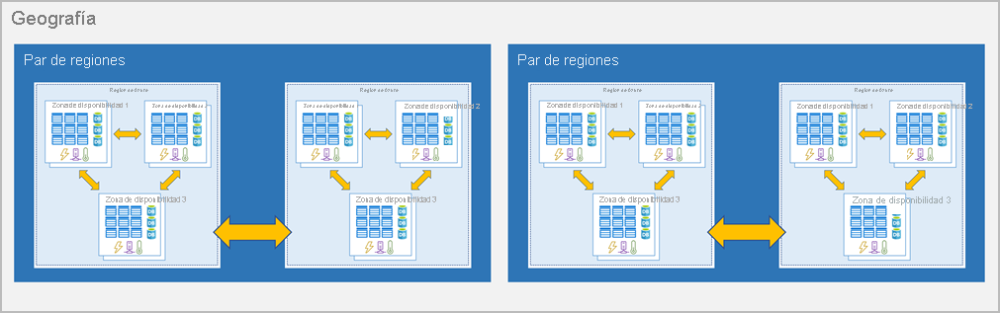
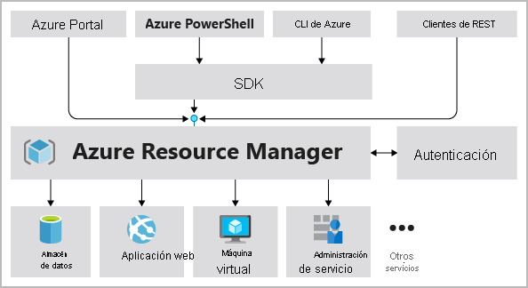
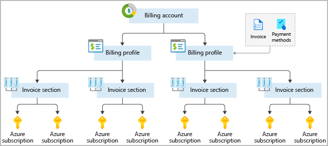
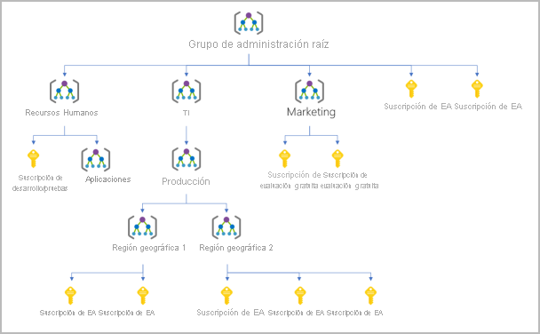
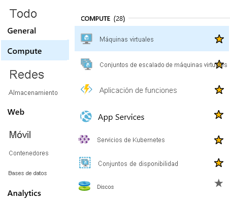
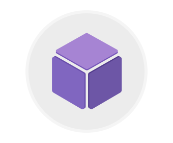
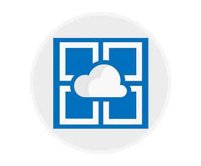

### Proceso
Los servicios de proceso a menudo son una de las razones principales de por qué las compañías se cambian a la plataforma Azure. Azure proporciona una amplia gama de opciones para hospedar aplicaciones y servicios. Estos son algunos ejemplos de servicios de proceso en Azure.

|Nombre del servicio|Función del servicio|
|---|---|
|Azure Virtual Machines|Máquinas virtuales (VM) Windows o Linux hospedadas en Azure.
|Azure Virtual Machine Scale Sets|Escalado de máquinas virtuales Windows o Linux hospedadas en Azure.
|Azure Kubernetes Service|Administración de clústeres para máquinas virtuales que ejecutan servicios en contenedores.
|Azure Service Fabric|Plataforma de sistemas distribuidos que se ejecuta en Azure o en el entorno local.
|Azure Batch|Servicio administrado para aplicaciones informáticas de alto rendimiento y paralelas.
|Azure Container Instances|Aplicaciones en contenedores que se ejecutan en Azure sin necesidad de aprovisionar servidores ni máquinas virtuales.
|Azure Functions|Un servicio de procesos sin servidor y controlado por eventos

### Redes
La vinculación de recursos de proceso y el suministro de acceso a las aplicaciones es la función clave de la red de Azure. La funcionalidad de red de Azure incluye una gama de opciones para conectar el mundo exterior a servicios y características de los centros de datos globales de Azure.

Estos son algunos ejemplos de los servicios de red de Azure.

|Nombre del servicio|Función del servicio|
|---|---|
|Azure Virtual Network|Conecta máquinas virtuales a conexiones de red privada virtual (VPN) entrantes.
|Azure Load Balancer|Equilibra las conexiones entrantes y salientes a aplicaciones o puntos de conexión de servicio.
|Azure Application Gateway|Optimiza la entrega de granjas de servidores de aplicaciones y, al mismo tiempo, aumenta la seguridad de las aplicaciones.
|Azure VPN Gateway|Accede a redes de Azure Virtual Network mediante puertas de enlace de VPN de alto rendimiento.
|Azure DNS|Proporciona respuestas DNS ultrarrápidas y disponibilidad de dominio extremadamente alta.
|Azure Content Delivery Network|Entrega contenido de gran ancho de banda a los clientes globalmente.
|Azure DDoS Protection|Protege las aplicaciones hospedadas en Azure frente a ataques por denegación de servicio distribuido (DDoS).
|Azure Traffic Manager|Distribuye el tráfico de red entre las regiones de Azure en todo el mundo.
|Azure ExpressRoute|Se conecta a Azure mediante conexiones seguras de gran ancho de banda dedicadas.
|Azure Network Watcher|Supervisa y diagnostica problemas de red mediante el análisis basado en el escenario.
|Azure Firewall|Implementa un firewall de alta seguridad y alta disponibilidad con escalabilidad ilimitada.
|Azure Virtual WAN|Crea una red de área extensa (WAN) unificada que conecta sitios locales y remotos.

### Almacenamiento

Azure proporciona cuatro tipos principales de servicios de almacenamiento.

|Nombre del servicio|Función del servicio|
|---|---|
|Azure Blob Storage|Servicio de almacenamiento para objetos muy grandes, como archivos de vídeo o mapas de bits.
|Azure File storage|Recursos compartidos de archivos que puede administrar como un servidor de archivos y acceder a ellos del mismo modo.
|Azure Queue Storage|Almacén de datos para la puesta en cola y la entrega confiable de mensajes entre aplicaciones.
|Azure Table storage|Table Storage es un servicio que almacena datos estructurados no relacionales (también conocidos como datos NoSQL estructurados) en la nube, lo que proporciona un almacén de claves y atributos con un diseño sin esquema.

Todos estos servicios comparten varias características:

- Durabilidad y alta disponibilidad con redundancia y la replicación.
- Seguridad mediante el cifrado automático y control de acceso basado en rol.
- Escalabilidad con un almacenamiento prácticamente ilimitado.
- Administración y control del mantenimiento y de cualquier problema crítico que pueda surgir.
- Accesibilidad desde cualquier parte del mundo a través de HTTP o HTTPS.

### Móvil

Con Azure, los desarrolladores pueden crear servicios de back-end móviles para aplicaciones iOS, Android y Windows de forma rápida y sencilla. Las características que solían tardar tiempo y aumentaban los riesgos del proyecto, como la incorporación del inicio de sesión corporativo y la posterior conexión a recursos locales como SAP, Oracle, SQL Server y SharePoint, ahora se incluyen con facilidad.

Estas son otras características de este servicio:

- Sincronización de datos sin conexión.
- Conectividad a datos locales.
- Difusión de notificaciones de inserción.
- Escalado automático para satisfacer las necesidades del negocio.

### Bases de datos
Azure proporciona varios servicios de base de datos para almacenar una gran variedad de volúmenes y tipos de datos. Y con la conectividad global, los usuarios disponen de estos datos al instante.

|Nombre del servicio|Función del servicio|
|---|---|
|Azure Cosmos DB|Base de datos distribuida globalmente que admite opciones NoSQL.
|Azure SQL Database|Base de datos relacional totalmente administrada con escalado automático, inteligencia integral y seguridad sólida.
|Azure Database for MySQL|Base de datos relacional MySQL totalmente administrada y escalable con alta disponibilidad y seguridad.
|Azure Database for PostgreSQL|Base de datos relacional PostgreSQL totalmente administrada y escalable con alta disponibilidad y seguridad.
|SQL Server en Azure Virtual Machines|Servicio que hospeda aplicaciones empresariales de SQL Server en la nube.
|Azure Synapse Analytics|Almacén de datos totalmente administrado con seguridad integral en todos los niveles de escala sin costo adicional.
|Azure Database Migration Service|Servicio que migra bases de datos a la nube sin cambios en el código de aplicación.
|Azure Cache for Redis|Servicio totalmente administrado que almacena en caché datos estáticos y usados con frecuencia para reducir la latencia de datos y aplicaciones.
|Azure Database for MariaDB|Base de datos relacional MariaDB totalmente administrada y escalable con alta disponibilidad y seguridad.

### Web
En el mundo empresarial actual es fundamental tener una experiencia web excelente. Azure incluye soporte técnico de primera clase para compilar y hospedar aplicaciones web y servicios web basados en HTTP. Los siguientes servicios de Azure se centran en el hospedaje web.

|Nombre del servicio|Descripción|
|---|---|
|Azure App Service|Creación rápida de aplicaciones en la nube eficaces basadas en web.
|Azure Notification Hubs|Envíe notificaciones push a cualquier plataforma desde cualquier back-end.
|Azure API Management|Publique API para desarrolladores, asociados y empleados de forma segura y a escala.
|Azure Cognitive Search|Esta búsqueda completamente administrada se implementa como servicio.
|Característica Web Apps de Azure App Service|Cree e implemente rápidamente aplicaciones web críticas a escala.
|Servicio Azure SignalR|Agregue funcionalidades web en tiempo real con facilidad.

### IoT
Los usuarios pueden tener acceso a más información que nunca. Los asistentes digitales personales llevaron a los smartphones y ahora existen relojes inteligentes, termostatos inteligentes e incluso frigoríficos inteligentes. Los equipos estaban a la orden del día. Ahora, Internet permite que cualquier objeto capaz de conectarse tenga acceso a valiosa información. Esta capacidad de los dispositivos de obtener y luego retransmitir información para el análisis de datos se conoce como IoT (Internet de las cosas).

Muchos servicios pueden ayudar e impulsar soluciones de un extremo a otro para IoT en Azure.

|Nombre del servicio|Descripción
|---|---|
|IoT Central|Solución global de software como servicio (SaaS) de IoT totalmente administrada que facilita la conexión, la supervisión y la administración de los recursos de IoT a escala.
|Azure IoT Hub|Centro de mensajería que proporciona comunicaciones y supervisión seguras entre millones de dispositivos de IoT.
|IoT Edge|Servicio totalmente administrado que permite insertar los modelos de análisis de datos directamente en los dispositivos IoT, lo que les permite responder rápidamente a los cambios de estado sin necesidad de consultar modelos de IA basados en la nube.

### Macrodatos

Los datos se presentan en cualquier formato y tamaño. Cuando hablamos sobre macrodatos, nos referimos a grandes volúmenes de datos. Los datos de los sistemas del tiempo, sistemas de comunicaciones, investigación genómica, plataformas de imágenes y muchos otros escenarios generan cientos de gigabytes de datos. Esta cantidad de datos hace que resulte difícil analizar y tomar decisiones. A menudo es tan grande que las formas de procesamiento y análisis tradicionales ya no son adecuadas.

Se han desarrollado tecnologías de clúster de código abierto para tratar con estos grandes conjuntos de datos. Azure admite una amplia gama de tecnologías y servicios para proporcionar soluciones de análisis y macrodatos.

|Nombre del servicio|Descripción|
|---|---|
|Azure Synapse Analytics|Ejecute análisis a gran escala mediante un almacenamiento de datos empresarial basado en la nube que aprovecha las ventajas del procesamiento paralelo masivo para ejecutar rápidamente consultas complejas en petabytes de datos.
|HDInsight de Azure|Procese grandes cantidades de datos con los clústeres administrados de Hadoop en la nube.
|Azure Databricks|Integre este servicio de análisis colaborativo basado en Apache Spark con otros servicios de macrodatos en Azure.

## INTELIGENCIA ARTIFICIAL

En el contexto de la informática en la nube, la inteligencia artificial se basa en una amplia gama de servicios, donde el principal es el aprendizaje automático. El aprendizaje automático es una técnica de ciencia de datos que permite a los equipos utilizar datos existentes para prever tendencias, resultados y comportamientos futuros. Mediante el aprendizaje automático, los equipos aprenden sin necesidad de programarlos explícitamente.

Las previsiones o predicciones del aprendizaje automático pueden hacer que las aplicaciones y los dispositivos sean más inteligentes. Por ejemplo, al comprar en línea, el aprendizaje automático le recomienda otros productos que le pueden gustar según lo que haya comprado. O bien, al pasar la tarjeta de crédito, el aprendizaje automático compara la transacción con una base de datos de transacciones y ayuda a detectar fraudes. Y cuando la aspiradora robot aspira una sala, el aprendizaje automático le ayuda a decidir si se ha terminado el trabajo.

Estos son algunos de los tipos de servicios de inteligencia artificial y aprendizaje automático más comunes de Azure.

|Nombre del servicio|Descripción|
|---|---|
|Azure Machine Learning Service|Entorno basado en la nube que puede usar para desarrollar, entrenar, probar, implementar, administrar y realizar un seguimiento de los modelos de aprendizaje automático. Puede generar y ajustar automáticamente un modelo. Le permite comenzar a entrenar en el equipo local y luego escalar horizontalmente a la nube.
|Azure ML Studio|Área de trabajo visual colaborativa donde puede compilar, probar e implementar soluciones de aprendizaje automático mediante algoritmos de aprendizaje automático predefinidos y módulos de control de datos.

**Cognitive Services** es un conjunto de productos estrechamente relacionados. Puede usar estas API precompiladas en las aplicaciones para solucionar problemas complejos.

|Nombre del servicio|Descripción|
|---|---|
|Visión|Use algoritmos de procesamiento de imágenes para identificar, subtitular, indexar y moderar imágenes y vídeos.
|Voz|Convierta voz en texto, use la voz para la comprobación o agregue reconocimiento del hablante a la aplicación.
|Asignación de conocimiento|Asigne información y datos complejos para resolver tareas como las de recomendaciones inteligentes y búsqueda semántica.
|Bing Search|Agregue las Bing Search API a sus aplicaciones y aproveche la capacidad de combinar miles de millones de páginas web, imágenes, vídeos y noticias con una sola llamada API.
|Procesamiento de lenguaje natural|permita que las aplicaciones procesen lenguaje natural con scripts precompilados, evalúen opiniones y aprendan a reconocer lo que quieren los usuarios.
---------
### DevOps
DevOps reúne a individuos, procesos y tecnología mediante la automatización de la entrega de software para ofrecer un valor continuo a los usuarios. Con Azure DevOps puede crear, compilar y publicar canalizaciones que proporcionan integración, entrega e implementación continuas a las aplicaciones. Puede integrar los repositorios y las pruebas de aplicaciones, realizar la supervisión de aplicaciones y trabajar con artefactos de compilación. También puede trabajar con elementos de trabajo pendiente para realizar el seguimiento, automatizar la implementación de la infraestructura e integrar una gama de herramientas y servicios de terceros como Jenkins y Chef. Todas estas funciones y muchas más están estrechamente integradas con Azure para permitir implementaciones coherentes y reproducibles para que las aplicaciones proporcionen unos procesos de compilación y lanzamiento optimizados.

|Nombre del servicio|Descripción|
|---|---|
|Azure DevOps|Use herramientas de colaboración de desarrollo como canalizaciones de alto rendimiento, repositorios Git privados gratuitos, paneles Kanban configurables y completas pruebas de carga basadas en la nube y automatizadas. Anteriormente conocido como Visual Studio Team Services.
|Azure DevTest Labs|Cree rápidamente entornos de Windows y Linux a petición para probar o realizar demostraciones de las aplicaciones directamente desde canalizaciones de implementación.
--------

# Descripción de los distintos tipos de modelos en la nube

## ¿Qué son las nubes pública, privada e híbrida?

Hay tres modelos de implementación para la informática en la nube: nube pública, nube privada y nube híbrida. Cada modelo de implementación tiene distintos aspectos que debe tener en cuenta a la hora de migrar a la nube.

|Modelo de implementación | Descripción
|---|---|
Nube pública|Los servicios se ofrecen a través de la red Internet pública y están disponibles para cualquiera que quiera comprarlos. Los recursos de nube, como los servidores y el almacenamiento, son propiedad de un proveedor de servicios en la nube de terceros, que los explota y los distribuye a través de Internet.
|Nube privada | Una nube privada consta de recursos informáticos que determinados usuarios de una empresa u organización usan en exclusiva. Una nube privada puede estar ubicada físicamente en el centro de datos local (entorno local) de la organización o estar hospedada por un proveedor de servicios de terceros.
Nube híbrida| Una nube híbrida es un entorno informático que combina una nube pública y una nube privada, lo que permite compartir datos y aplicaciones entre ellas.

## Comparación de modelos de nube
**Nube pública**
- No hay gastos de capital para escalar verticalmente.
- Las aplicaciones pueden aprovisionarse y desaprovisionarse rápidamente.
- Las organizaciones solo pagan por lo que usan.

**Nube privada**
- Debe adquirirse hardware para el inicio y el mantenimiento.
- Las organizaciones tienen un control total de los recursos y la seguridad.
- Las organizaciones son responsables del mantenimiento y las actualizaciones del hardware.

**Nube híbrida**
- Proporciona la máxima flexibilidad.
- Las organizaciones determinan dónde se van a ejecutar sus aplicaciones.
- Las organizaciones controlan la seguridad, el cumplimiento o los requisitos legales.

## ¿Cuáles son algunas de las ventajas de la informática en la nube?

Los entornos en la nube ofrecen varias ventajas en comparación con los entornos físicos. Tailwind Traders puede aprovecharlas después de su migración a Azure.

- **Alta disponibilidad:** en función del contrato de nivel de servicio (SLA) que elija, las aplicaciones basadas en la nube pueden proporcionar una experiencia de usuario continua sin tiempo de inactividad perceptible, aunque se produzcan errores.

- **Escalabilidad:** las aplicaciones en la nube se pueden escalar _verticalmente y horizontalmente_:

    - Escale verticalmente para aumentar la capacidad de proceso mediante la incorporación de RAM o CPU adicionales a una máquina virtual.
    - El escalado horizontal aumenta la capacidad de proceso mediante la adición de instancias de recursos, como la incorporación de máquinas virtuales a la configuración.

- **Elasticidad:** puede configurar aplicaciones basadas en la nube para aprovechar el escalado automático, de forma que las aplicaciones siempre dispondrán de los recursos que necesitan.

- **Agilidad:** implemente y configure rápidamente los recursos basados en la nube a medida que cambian los requisitos de la aplicación.

- **Distribución geográfica:** puede implementar aplicaciones y datos en centros de datos regionales de todo el mundo, lo que garantiza que sus clientes siempre tendrán el mejor rendimiento de su región.

- **Recuperación ante desastres:** al usar los servicios de copia de seguridad basados en la nube, la replicación de datos y la distribución geográfica, podrá implementar las aplicaciones con la seguridad de saber que los datos están protegidos en caso de que se produzca un desastre.

## Gastos de capital en comparación con los gastos operativos
Hay dos tipos diferentes de gastos que se deben tener en cuenta:

- **Los gastos de capital (CapEx)** hacen referencia a la inversión previa de dinero en infraestructura física, que se podrá deducir a lo largo del tiempo. El costo previo de CapEx tiene un valor que disminuye con el tiempo.
- **Los gastos operativos (OpEx)** son dinero que se invierte en servicios o productos y se factura al instante. Este gasto se puede deducir el mismo año que se produce. No hay ningún costo previo, ya que se paga por un servicio o producto a medida que se usa.

> **_En resumen, CapEx requiere unos costos financieros previos considerables, así como unos gastos continuos de mantenimiento y soporte técnico. En cambio, OpEx es un modelo basado en el consumo, así que Tailwind Traders solo es responsable del costo de los recursos informáticos que utiliza._**

## La informática en la nube es un modelo basado en el consumo

Los proveedores de servicios en la nube operan en un modelo basado en el consumo, lo que significa que los usuarios finales solo pagan por los recursos que usan. Lo que usan es lo que pagan.

Los modelos basados en el consumo aportan muchas ventajas, por ejemplo:

- Sin costes por adelantado.
- No es necesario comprar ni administrar infraestructuras costosas que es posible que los usuarios no aprovechen del todo.
- Se puede pagar para obtener recursos adicionales cuando se necesiten.
- Se puede dejar de pagar por los recursos que ya no se necesiten.

## Descripción de distintos servicios en la nube

### **¿Qué son los modelos de servicio en la nube?**

Si hace tiempo que tiene conocimientos sobre la informática en la nube, es probable que haya visto los acrónimos _PaaS, IaaS y SaaS_ de los diferentes modelos de servicio en la nube. Estos modelos definen los diferentes niveles de responsabilidad compartida de un proveedor de nube y un inquilino de nube.

|Modelo|Definición |Descripción |
|---|---|---|
|**IaaS**|Infraestructura como servicio|Este modelo de servicio en la nube es el más similar a la administración de servidores físicos; un proveedor de servicios en la nube mantendrá actualizado el hardware, pero el mantenimiento del sistema operativo y la configuración de red serán su responsabilidad como inquilino de nube. Por ejemplo, las máquinas virtuales de Azure son dispositivos de proceso virtuales totalmente operativos que se ejecutan en centros de datos de Microsoft. Una ventaja de este modelo de servicio en la nube es la rápida implementación de nuevos dispositivos de proceso. Configurar una máquina virtual nueva es considerablemente más rápido que obtener, instalar y configurar un servidor físico.
**PaaS**|Plataforma como servicio|Este modelo de servicio en la nube es un entorno de hospedaje administrado. El proveedor de servicios en la nube administra las máquinas virtuales y los recursos de red, y el inquilino de nube implementa sus aplicaciones en el entorno de hospedaje administrado. Por ejemplo, Azure App Services proporciona un entorno de hospedaje administrado en el que los desarrolladores pueden cargar sus aplicaciones web sin tener que preocuparse por los requisitos de hardware y software físicos.
**SaaS**|Software como servicio|En este modelo de servicio en la nube, el proveedor de servicios en la nube administra todos los aspectos del entorno de la aplicación, como las máquinas virtuales, los recursos de red, el almacenamiento de datos y las aplicaciones. El inquilino de nube solo necesita proporcionar sus datos a la aplicación administrada por el proveedor de servicios en la nube. Por ejemplo, Microsoft Office 365 proporciona una versión de Microsoft Office totalmente operativa que se ejecuta en la nube. Lo único que debe hacer es crear el contenido, y Office 365 se encargará de todo lo demás.

### IaaS

IaaS es la categoría más flexible de servicios en la nube. Su objetivo es ofrecer un control completo sobre el hardware que ejecuta la aplicación. En vez de comprar hardware, con IaaS, se alquila.

### Ventajas
**Sin gastos de capital (CapEx).** Los usuarios no tienen costos iniciales.

**Agilidad.** Se pueden configurar las aplicaciones con rapidez para que sean accesibles y desaprovisionarlas cuando sea necesario.

**Administración.** Se aplica el modelo de responsabilidad compartida; el usuario administra y mantiene los servicios que ha aprovisionado, y el proveedor de nube administra y mantiene la infraestructura en la nube.

**Modelo basado en el consumo**. Las organizaciones solo pagan por lo que usan y operan en un modelo de gastos operativos (OpEx).

**Aptitudes.** No se requieren conocimientos técnicos avanzados para implementar y usar una nube pública u obtener las ventajas que esta ofrece. Las organizaciones pueden utilizar las aptitudes y la experiencia del proveedor de nube para asegurarse de que las cargas de trabajo sean seguras, estén protegidas y tengan alta disponibilidad.

**Ventajas que ofrece la nube.** Las organizaciones pueden utilizar las aptitudes y la experiencia del proveedor de nube para asegurarse de que las cargas de trabajo se configuren de forma que sean seguras y tengan alta disponibilidad.

**Flexibilidad.** IaaS es el servicio en la nube más flexible, ya que se dispone de control para configurar y administrar el hardware que ejecuta una aplicación.

### PaaS
PaaS proporciona las mismas ventajas y consideraciones que IaaS, pero ofrece algunas ventajas adicionales que es importante conocer.

**Ventajas**
Sin gastos de capital (CapEx). Los usuarios no tienen costos iniciales.

**Agilidad.** PaaS es más ágil que IaaS, y no es necesario que los usuarios configuren servidores para ejecutar aplicaciones.

**Modelo basado en el consumo.** Los usuarios solo pagan por lo que usan y operan bajo un modelo OpEx.

**Aptitudes.** No se requieren conocimientos técnicos avanzados para implementar y usar una plataforma PaaS u obtener las ventajas que esta ofrece.

**Ventajas que ofrece la nube.** Los usuarios pueden aprovechar las aptitudes y la experiencia del proveedor de nube para asegurarse de que sus cargas de trabajo sean seguras y tengan alta disponibilidad. Además, los usuarios pueden obtener acceso a más herramientas de desarrollo punteras. Entonces, las podrán aplicar al ciclo de vida de una aplicación.

**Productividad.** Los usuarios se pueden centrar únicamente en el desarrollo de aplicaciones, ya que el proveedor de nube lleva a cabo toda la administración de plataformas. Trabajar con equipos distribuidos como servicios es más fácil, ya que se accede a la plataforma a través de Internet. Puede hacer que la plataforma esté disponible globalmente de forma más sencilla.

### Desventaja
**Limitaciones de la plataforma.** Es posible que en las plataformas en la nube haya una serie de limitaciones que pueden afectar al modo en el que una aplicación se ejecuta. Al evaluar qué plataforma PaaS es más adecuada para una carga de trabajo, debe tener en cuenta las limitaciones de esta área.

### SaaS
SaaS es software que se hospeda y administra de forma centralizada para usted y sus usuarios o clientes. Normalmente se usa una versión de la aplicación para todos los clientes y la licencia se obtiene mediante una suscripción mensual o anual.

SaaS proporciona las mismas ventajas que IaaS, pero también ofrece algunas ventajas adicionales que es importante conocer.

**Ventajas**
Sin gastos de capital (CapEx). Los usuarios no tienen costos iniciales.

**Agilidad.** Los usuarios pueden proporcionar al personal acceso al software más reciente de forma fácil y rápida.

**Modelo de precio de pago por uso.** Los usuarios pagan por el software que usan mediante un modelo de suscripción, que habitualmente es mensual o anual, independientemente de cuánto usen el software.

**Aptitudes.** No se requieren conocimientos técnicos avanzados para implementar y usar software SaaS u obtener las ventajas que este ofrece.

**Flexibilidad.** Los usuarios pueden acceder a los mismos datos de la aplicación desde cualquier lugar.

### Desventaja
**Limitaciones de software.** Es posible que en las aplicaciones de software haya una serie de limitaciones que pueden afectar al modo en el que los usuarios trabajan. Como está usando el software tal cual, no tiene un control directo de las características. Al evaluar qué plataforma SaaS es más adecuada para una carga de trabajo, debe tener en cuenta cualquier necesidad empresarial y las limitaciones de software.

|IaaS|PaaS|SaaS|
|---|---|---|
El servicio en la nube más flexible.|Céntrese en el desarrollo de aplicaciones.|Modelo de precio de pago por uso.
Configure y administre el hardware de la aplicación.| El proveedor de nube controla la administración de la plataforma.|Los usuarios pagan por el software que utilizan en un modelo de suscripción.

## Qué es la informática sin servidor?
Igual que PaaS, la informática sin servidor permite que los desarrolladores creen aplicaciones más rápidamente, ya que elimina la necesidad de administrar la infraestructura. En las aplicaciones sin servidor, el proveedor de servicios en la nube aprovisiona, escala y administra automáticamente la infraestructura necesaria para ejecutar el código. Las arquitecturas sin servidor son muy escalables y controladas por eventos, y solo usan recursos cuando se produce una función o un desencadenador concretos.

Es importante tener en cuenta que los servidores siguen ejecutando el código. El término "sin servidor" procede del hecho de que las tareas asociadas a la administración y el aprovisionamiento de la infraestructura son invisibles para el desarrollador. Este enfoque permite a los desarrolladores centrar su atención en la lógica de negocios y ofrecer más valor al núcleo de la empresa. La informática sin servidor ayuda a los equipos a aumentar su productividad y a llevar los productos al mercado con más rapidez, y permite a las organizaciones optimizar mejor los recursos y seguir centrándose en la innovación.

## Introducción a las suscripciones, los grupos de administración y los recursos de Azure

Una vez vista la jerarquía vertical de la organización, describamos cada uno de estos niveles empezando desde abajo:

- **Recursos:** Los recursos son instancias de servicios que puede crear, como máquinas virtuales, almacenamiento o bases de datos SQL.
- **Grupos de recursos:** Los recursos se combinan en grupos de recursos, que actúan como contenedor lógico en el que se implementan y administran recursos de Azure como aplicaciones web, bases de datos y cuentas de almacenamiento.
- **Suscripciones:** Una suscripción agrupa las cuentas de usuario y los recursos que han creado esas cuentas de usuario. Para cada suscripción, hay límites o cuotas en la cantidad de recursos que se pueden crear y usar. Las organizaciones pueden usar las suscripciones para administrar los costos y los recursos creados por los usuarios, equipos o proyectos.
- **Grupos de administración:** Estos grupos le ayudan a administrar el acceso, las directivas y el cumplimiento de varias suscripciones. Todas las suscripciones de un grupo de administración heredan automáticamente las condiciones que se aplican al grupo de administración.

## Zonas de disponibilidad, pares de regiones y regiones de Azure

### Regiones de Azure

Una _región_ es un área geográfica del planeta que contiene al menos un centro de datos, aunque podrían ser varios centros de datos cercanos y conectados mediante una red de baja latencia. Azure asigna y controla los recursos de forma inteligente dentro de cada región para garantizar que las cargas de trabajo están bien compensadas.

Al implementar un recurso en Azure, es habitual tener que elegir la región en la que quiere que se implemente el recurso.

> **Importante**
Algunos servicios o características de las máquinas virtuales solo están disponibles en determinadas regiones, como, por ejemplo, tipos de almacenamiento o tamaños de VM específicos. También hay algunos servicios globales de Azure que no requieren que seleccione una región concreta, como Azure Active Directory, Azure Traffic Manager o Azure DNS.

Algunos ejemplos de regiones son: Oeste de EE. UU., Centro de Canadá, Europa Occidental, Este de Australia y Japón Occidental. A continuación puede ver todas las regiones disponibles a fecha de junio de 2020.

## ¿Por qué son importantes las regiones?

Las regiones globales proporcionan una mejor escalabilidad y redundancia, y conservan la residencia de datos para los servicios.

### Regiones de Azure especiales
Azure tiene regiones especializadas que se pueden usar al crear las aplicaciones, en lo referente al cumplimiento normativo o a aspectos legales. Algunos ejemplos incluyen:

- **US DoD (centro), US Gov Virginia, US Gov Iowa y más:** Estas regiones son instancias físicas y lógicas con aislamiento de red de Azure para asociados y agencias de la administración pública de EE. UU. Estos centros de datos están operados por personal estadounidense sometido a evaluación e incluyen certificaciones de cumplimiento adicionales.
- **Este de China, Norte de China y más:** Estas regiones están disponibles gracias a una asociación exclusiva entre Microsoft y 21Vianet, por la cual Microsoft no mantiene directamente los centros de datos.

Las regiones se utilizan para identificar la ubicación de los recursos, pero hay otros dos términos que también debe conocer: _zonas geográficas y zonas de disponibilidad._

## Zonas de disponibilidad de Azure
A fin de proteger la información en caso de error, deberá asegurarse de que los servicios y datos son redundantes. Si hospeda su infraestructura, configurar su propia redundancia requiere la creación de entornos de hardware duplicados. Azure puede ayudar a que la aplicación tenga alta disponibilidad a través de zonas de disponibilidad.

### ¿Qué es una zona de disponibilidad?
Las zonas de disponibilidad son centros de datos separados físicamente dentro de una región de Azure. Cada zona de disponibilidad consta de uno o varios centros de datos equipados con alimentación, refrigeración y redes independientes. Una zona de disponibilidad se configura para constituir un límite de aislamiento. Si una zona deja de funcionar, la otra continúa trabajando. Las zonas de disponibilidad están conectadas a través de redes de fibra óptica de alta velocidad privadas.

### Regiones admitidas
No todas las regiones son compatibles con las zonas de disponibilidad. Para obtener una lista actualizada, consulte [Regiones que admiten Availability Zones en Azure](https://docs.microsoft.com/es-es/azure/availability-zones/az-region).

### Uso de las zonas de disponibilidad en sus aplicaciones

Las zonas de disponibilidad son principalmente para las máquinas virtuales, los discos administrados, los equilibradores de carga y las bases de datos SQL. Los servicios de Azure que admiten zonas de disponibilidad se dividen en dos categorías:

- Servicios de zona: ancle el recurso a una zona específica (por ejemplo, máquinas virtuales, discos administrados, direcciones IP).
- Servicios de redundancia de zona: la plataforma se replica automáticamente entre zonas (por ejemplo, almacenamiento con redundancia de zona, SQL Database).

## Pares de regiones de Azure
Las zonas de disponibilidad se crean usando uno o varios centros de datos. Hay un mínimo de tres zonas en una sola región. Es posible que un desastre grande pueda provocar una interrupción tan grave como para afectar incluso a dos centros de datos. Por eso Azure también crea pares de regiones.

### ¿Qué es un par de regiones?
Cada región de Azure se empareja siempre con otra región de la misma zona geográfica (por ejemplo, EE. UU., Europa o Asia) que se encuentre como mínimo a 500 km de distancia. Este enfoque permite la replicación de recursos, como el almacenamiento en la máquina virtual, en una zona geográfica, lo que ayuda a reducir la probabilidad de que se produzcan interrupciones provocadas por eventos como desastres naturales, disturbios civiles, cortes del suministro eléctrico o interrupciones de la red física que afecten de forma simultánea a ambas regiones. Si una región de un par se ve afectada por un desastre natural, por ejemplo, los servicios conmutarán por error automáticamente a la otra región de su par de regiones.

> Algunos pares de regiones de ejemplo en Azure son Oeste de EE. UU. y Este de EE. UU., o Sudeste Asiático y Asia Pacífico.

Ventajas adicionales de los pares de región:

- Si se produce una gran interrupción de Azure, se da prioridad a una región de cada par para asegurarse de que al menos una se restaure lo más rápido posible para las aplicaciones hospedadas en ese par de regiones.
- Las actualizaciones planeadas de Azure se implementan una a una en regiones emparejadas para minimizar el tiempo de inactividad y el riesgo de interrupción de la aplicación.
- Los datos siguen residiendo en la misma zona geográfica que su pareja (excepto Sur de Brasil) con fines de jurisdicción fiscal y de aplicación de la ley.

> Tener un conjunto ampliamente distribuido de centros de datos permite a Azure proporcionar una alta garantía de disponibilidad.

## Recursos de Azure y Azure Resource Manager

- **Recurso:** elemento administrable que está disponible mediante Azure. Algunos ejemplos de recursos son las máquinas virtuales (VM), las cuentas de almacenamiento, las aplicaciones web, las bases de datos y las redes virtuales.
- **Grupo de recursos:** contenedor que incluye los recursos relacionados para una solución de Azure. El grupo de recursos incluye los recursos que se quieren administrar como grupo. Decida qué recursos pertenecen a un grupo de recursos según lo que más convenga a su organización.

### Grupos de recursos de Azure
Los grupos de recursos son un elemento fundamental de la plataforma Azure. Un grupo de recursos es un contenedor lógico para recursos implementados en Azure. Estos recursos pueden ser cualquier cosa que cree en una suscripción de Azure como máquinas virtuales, instancias de Azure Application Gateway y de Azure Cosmos DB. Todos los recursos deben estar en un grupo de recursos, y un recurso solo puede ser miembro de un único grupo de recursos. Muchos recursos pueden moverse entre grupos de recursos con algunos servicios que tengan limitaciones o requisitos determinados para mover. Los grupos de recursos no se pueden anidar. Antes de poder aprovisionar un recurso, necesita un grupo de recursos en el que colocarlo.

### Agrupación lógica
Los grupos de recursos existen para ayudar a administrar y organizar los recursos de Azure. Al colocar recursos de uso, tipo o ubicación similar en un grupo de recursos, puede proporcionar orden y organización a los recursos que cree en Azure. La agrupación lógica es el aspecto que más le interesa, ya que, entre los recursos, el desorden es elevado.

### Ciclo de vida
Si elimina un grupo de recursos, también se eliminarán todos los recursos que contenga. La organización de los recursos por ciclo de vida puede ser útil en entornos que no sean de producción, en los que puede probar un experimento y después descartarlo. Los grupos de recursos facilitan la tarea de quitar un conjunto de recursos a la vez.

### Autorización
Los grupos de recursos también son un ámbito para aplicar permisos de control de acceso basado en roles (RBAC). Al aplicar permisos RBAC a un grupo de recursos, puede facilitar la administración y limitar el acceso para permitir solo lo que sea necesario.

## Azure Resource Manager
Azure Resource Manager es el servicio de implementación y administración para Azure. Proporciona una capa de administración que le permite crear, actualizar y eliminar recursos de la cuenta de Azure. Puede usar características de administración como el control de acceso, los bloqueos y las etiquetas para proteger y organizar los recursos después de la implementación.

Cuando un usuario envía una solicitud de cualquiera de las herramientas, las API o los SDK de Azure, Resource Manager recibe la solicitud. Autentica y autoriza la solicitud. Resource Manager envía la solicitud al servicio de Azure, que lleva a cabo la acción solicitada. Dado que todas las solicitudes se controlan mediante la misma API, verá resultados y funcionalidades coherentes en todas las distintas herramientas.

En la imagen siguiente se muestra el rol que desempeña el Administrador de recursos en el control de solicitudes de Azure.

> Todas las funcionalidades que están disponibles en Azure Portal también lo están a través de PowerShell, la CLI de Azure, las API REST y los SDK de cliente.

### Ventajas de usar Administrador de recursos

Con Resource Manager puede:

- Administrar la infraestructura mediante plantillas declarativas en lugar de scripts. Una plantilla de Resource Manager es un archivo JSON que define lo que quiere implementar en Azure.
- Implementar, administrar y supervisar todos los recursos de la solución en grupo, en lugar de controlarlos individualmente.
- Vuelva a implementar la solución a lo largo del ciclo de vida de desarrollo y tenga la seguridad de que los recursos se implementan en un estado coherente.
- Definir las dependencias entre recursos de modo que se implementen en el orden correcto.
- Aplique control de acceso a todos los servicios, puesto que RBAC se integra de forma nativa en la plataforma de administración.
- Aplicar etiquetas a los recursos para organizar de manera lógica todos los recursos de la suscripción.
- Comprenda la facturación de la organización viendo los costos de un grupo de recursos que comparten la misma etiqueta.

## Suscripciones y grupos de administración de Azure
> **Nota**
Un recurso de Azure es un elemento administrable que está disponible mediante Azure. Algunos ejemplos de recursos son las máquinas virtuales (VM), las cuentas de almacenamiento, las aplicaciones web, las bases de datos y las redes virtuales.

### Suscripciones de Azure
**El uso de Azure requiere una suscripción de Azure**. Una suscripción le proporciona acceso autenticado y autorizado a los servicios y productos de Azure. Además, también le permite aprovisionar los recursos. Una suscripción de Azure es una unidad lógica de servicios de Azure que está vinculada a una cuenta de Azure, que es una identidad en Azure Active Directory (Azure AD) o en un directorio en el que confía Azure AD.

**Una cuenta puede tener una suscripción o varias suscripciones** que con distintos modelos de facturación y a las que se aplican diferentes directivas de administración de acceso. Puede usar las suscripciones de Azure para definir límites en torno a los productos, servicios y recursos de Azure. Hay dos tipos de límites de suscripción que puede utilizar:

- **Límite de facturación:** Este tipo de suscripción determina cómo se factura una cuenta de Azure por el uso de Azure. Puede crear varias suscripciones para diferentes tipos de requisitos de facturación. Azure genera facturas e informes de facturación independientes para cada suscripción, de modo que pueda organizar y administrar los costos.
- **Límite de control de acceso:** Azure aplica las directivas de administración de acceso en el nivel de suscripción, por lo que puede crear suscripciones independientes para reflejar distintas estructuras organizativas. Por ejemplo, dentro de una empresa hay diferentes departamentos a los que se pueden aplicar directivas de suscripción de Azure distintas. Este modelo de facturación le permite administrar y controlar el acceso a los recursos que los usuarios aprovisionan con suscripciones específicas.

### Creación de una suscripción de Azure adicional
Es posible que quiera crear suscripciones adicionales para fines de administración de facturación o de recursos. Por ejemplo, puede optar por crear suscripciones adicionales para separar lo siguiente:

- **Entornos:** cuando administra sus recursos, puede optar por crear suscripciones con el fin de configurar entornos independientes para el desarrollo y las pruebas, para seguridad o para aislar los datos por motivos de cumplimiento. Este diseño es especialmente útil porque el control de acceso a los recursos se produce en el nivel de suscripción.
- **Estructuras organizativas:** puede crear suscripciones para reflejar las distintas estructuras organizativas. Por ejemplo, podría limitar un equipo a recursos de bajo costo, al tiempo que permite que el departamento de TI tenga un alcance completo. Este diseño permite administrar y controlar el acceso a los recursos que los usuarios aprovisionan en cada suscripción.
- **Facturación:** es posible que también quiera crear suscripciones adicionales para fines de facturación. Dado que los costos se agregan primero en el nivel de suscripción, es posible que quiera crear suscripciones para administrar y realizar un seguimiento de los costos en función de sus necesidades. Por ejemplo, puede que quiera crear una suscripción para las cargas de trabajo de producción, y otra suscripción para las cargas de trabajo de desarrollo y pruebas.

Es posible que también necesite suscripciones adicionales debido a lo siguiente:

- **Límites de suscripción:** las suscripciones se enlazan a algunas limitaciones de hardware. Por ejemplo, el número máximo de circuitos de Azure ExpressRoute por cada suscripción es de 10. Esos límites se deben tener en consideración al crear suscripciones en la cuenta. Si en escenarios concretos hay que superar esos límites, es posible que se necesiten suscripciones adicionales.

### Personalización de la facturación para satisfacer sus necesidades
Si tiene varias suscripciones, puede organizarlas en secciones de la factura. Cada sección de la factura es un elemento de línea en la factura que muestra los cargos en los que se incurre ese mes. Por ejemplo, puede que necesite una única factura para la organización, pero quiere organizar los cargos por departamento, equipo o proyecto.

En función de sus necesidades, se pueden configurar varias facturas dentro de la misma cuenta de facturación. Para ello, cree perfiles de facturación adicionales. Cada perfil de facturación contiene su propia factura mensual y método de pago.

En el diagrama siguiente se muestra información general sobre cómo se estructura la facturación. Si ya se ha suscrito a Azure o si su organización tiene un Contrato Enterprise, puede que la facturación esté configurada de forma distinta.

### Grupos de administración de Azure
Si la organización tiene muchas suscripciones, es posible que necesite una forma de administrar con eficacia el acceso, las directivas y el cumplimiento para esas suscripciones. Los grupos de administración de Azure ofrecen un nivel de ámbito que está por encima de las suscripciones. Las suscripciones se organizan en contenedores llamados grupos de administración y las condiciones de gobernanza se aplican a los grupos de administración. Todas las suscripciones dentro de un grupo de administración heredan automáticamente las condiciones que se aplican al grupo de administración. Los grupos de administración proporcionan capacidad de administración de nivel empresarial a gran escala con independencia del tipo de suscripciones que tenga. Todas las suscripciones de un único grupo de administración deben confiar en el mismo inquilino de Azure AD.

Por ejemplo, puede aplicar directivas a un grupo de administración que limite las regiones disponibles para la creación de máquinas virtuales. Esta directiva se aplicaría a todos los grupos de administración, las suscripciones y los recursos de ese grupo de administración, al permitir únicamente que se creen máquinas virtuales en esa región.

### Jerarquía de los grupos de administración y las suscripciones
Puede compilar una estructura flexible de grupos de administración y suscripciones para organizar los recursos en una jerarquía para una administración unificada de las directivas y el acceso. El diagrama siguiente muestra un ejemplo de creación de una jerarquía para la gobernanza mediante grupos de administración.

Puede crear una jerarquía que aplique una directiva. Por ejemplo, puede limitar las ubicaciones de las máquinas virtuales a la región oeste de EE. UU. en un grupo denominado Producción. Esta directiva se heredará en todas suscripciones de Contrato Enterprise que sean descendientes de ese grupo de administración y se aplicará a todas las máquinas virtuales de esas suscripciones. El propietario de los recursos o las suscripciones no puede modificar esta directiva de seguridad, lo que permite una gobernanza mejorada.

Otro escenario en el que se usarían grupos de administración es para proporcionar acceso de usuario a varias suscripciones. Al mover muchas suscripciones bajo ese grupo de administración, puede crear una asignación de control de acceso basado en rol (RBAC) en el grupo de administración que heredará ese acceso en todas las suscripciones. Una asignación en el grupo de administración puede permitir a los usuarios acceder a todo lo que necesitan en lugar de realizar scripting para proporcionar control de acceso basado en rol sobre las distintas suscripciones.

### Hechos importantes acerca de los grupos de administración
- Se admiten 10 000 grupos de administración en un único directorio.
- Un árbol de grupo de administración puede admitir hasta seis niveles de profundidad. Este límite no incluye el nivel raíz ni el nivel de suscripción.
- Cada grupo de administración y suscripción solo puede admitir un elemento primario.
- Cada grupo de administración puede tener muchos elementos secundarios.
- Todas las suscripciones y grupos de administración están dentro de una única jerarquía en cada directorio.

### ¿Qué es App Service?
App Service es un servicio basado en HTTP que permite crear y hospedar muchos tipos de soluciones basadas en la Web sin necesidad de administrar la infraestructura. Por ejemplo, puede hospedar aplicaciones web, back-ends móviles y API de RESTful en varios lenguajes de programación admitidos. Las aplicaciones desarrolladas en .NET, .NET Core, Java, Ruby, Node.js, PHP o Python se pueden ejecutar y escalar con facilidad en entornos basados tanto en Windows como en Linux.

Para este ejercicio, queremos crear un sitio web en menos tiempo del que tardamos en almorzar. Por lo tanto, no vamos a escribir ningún código. En lugar de esto, implementará una aplicación predefinida desde Azure Marketplace.

### ¿Qué es Azure Marketplace?
Azure Marketplace es una tienda en línea que hospeda aplicaciones certificadas y optimizadas para ejecutarse en Azure. Existen muchos tipos de aplicaciones disponibles, que van desde la inteligencia artificial y Machine Learning a las aplicaciones web. Como veremos en un par de minutos, las implementaciones desde la tienda se realizan mediante Azure Portal, con una interfaz de usuario de tipo asistente. Esta interfaz de usuario permite evaluar fácilmente diferentes soluciones.

Vamos a usar una de las opciones de la aplicación de WordPress de Azure Marketplace para nuestro sitio web.

## Introducción a los servicios de Azure Compute

Azure Compute es un servicio de informática a petición para ejecutar aplicaciones basadas en la nube. Se proporcionan recursos informáticos como discos, procesadores, memoria, redes y sistemas operativos. Los recursos están disponibles a petición y normalmente pueden estar disponibles en minutos o incluso en segundos. Solo se paga por los recursos que se usan y solo durante el tiempo que se usan.

Azure admite una amplia gama de soluciones informáticas para el desarrollo y las pruebas, la ejecución de aplicaciones y la ampliación del centro de datos. El servicio es compatible con Linux, Windows Server, SQL Server, Oracle, IBM y SAP. Azure también tiene muchos servicios que pueden ejecutar máquinas virtuales (VM). Cada servicio proporciona opciones distintas en función de los requisitos. Algunos de los servicios más destacados son los siguientes:

- Azure Virtual Machines
- Azure Container Instances
- Azure App Service
- Azure Functions (o informática sin servidor)

**Máquinas virtuales** 

Las máquinas virtuales son emulaciones de software de equipos físicos. Incluyen un procesador virtual, memoria, almacenamiento y recursos de red. Hospedan un sistema operativo, y se puede instalar y ejecutar software, al igual que en un equipo físico. Al utilizar un cliente de escritorio remoto, puede usar y controlar la máquina virtual como si se estuviera sentado delante de ella.

Gracias a [Azure Virtual Machines](https://azure.microsoft.com/es-es/services/virtual-machines/), puede crear y utilizar máquinas virtuales en la nube. Virtual Machines proporciona infraestructura como servicio (IaaS) y se puede usar de maneras diferentes. Cuando necesite un control total sobre el entorno y el sistema operativo, las máquinas virtuales son la opción idónea. Al igual que sucede en un equipo físico, se puede personalizar todo el software que se ejecuta en la máquina virtual. Esta capacidad resulta útil cuando se ejecuta software personalizado o configuraciones de hospedaje personalizadas.

 **Conjuntos de escalado de máquinas virtuales**

[Los conjuntos de escalado de máquinas virtuales](https://azure.microsoft.com/es-es/services/virtual-machine-scale-sets/) son un recurso de Azure Compute que puede usar para implementar y administrar un conjunto de máquinas virtuales idénticas. Con todas las máquinas virtuales configuradas de la misma manera, los conjuntos de escalado de máquinas virtuales están diseñados para admitir el escalado automático verdadero. No es necesario el aprovisionamiento previo de las máquinas virtuales. Por este motivo, es más sencillo compilar servicios a gran escala cuyo destino sean las cargas de trabajo en contenedores, de macroproceso y macrodatos. A medida que la demanda aumente, se pueden agregar más instancias de máquina virtual. A medida que la demanda disminuya, se pueden quitar más instancias de máquina virtual. El proceso puede ser manual, automatizado o una combinación de ambos.

**Containers y Kubernetes**  

[Container Instances](https://azure.microsoft.com/es-es/services/container-instances/) y [Azure Kubernetes Service](https://azure.microsoft.com/es-es/services/kubernetes-service/)  recursos de Azure Compute que puede usar para implementar contenedores y administrarlos. Los contenedores son entornos de aplicación ligeros y virtualizados. Están diseñados para crearse, escalarse horizontalmente y detenerse dinámicamente de forma rápida. Puede ejecutar varias instancias de una aplicación en contenedores en un único equipo host.

 **App Service**

Con [Azure App Service](https://azure.microsoft.com/es-es/services/app-service/) puede compilar, implementar y escalar de forma rápida aplicaciones de API, móviles y web de nivel empresarial que se pueden ejecutar en cualquier plataforma. Puede satisfacer los exigentes requisitos de rendimiento, escalabilidad, seguridad y cumplimiento mientras usa una plataforma totalmente administrada para realizar el mantenimiento de la infraestructura. App Service es una oferta de plataforma como servicio (PaaS).

**Funciones**

[Functions](https://azure.microsoft.com/es-es/services/functions/) es una opción ideal si le preocupa solo el código que ejecuta el servicio y no la infraestructura o la plataforma subyacente. Se usan normalmente cuando se debe realizar un trabajo en respuesta a un evento (a menudo a través de una solicitud REST), un temporizador o un mensaje de otro servicio de Azure, y cuando ese trabajo puede completarse rápidamente, en segundos o en menos tiempo.

## Decisión de cuándo usar Azure Virtual Machines

Gracias a Azure Virtual Machines, puede crear y utilizar máquinas virtuales en la nube. Estas máquinas virtuales proporcionan una infraestructura como servicio (IaaS) en forma de un servidor virtualizado y se pueden usar de muchas formas. Al igual que sucede en un equipo físico, se puede personalizar todo el software que se ejecuta en la máquina virtual. Las máquinas virtuales son una opción ideal cuando se necesita lo siguiente:

- Control total sobre el sistema operativo (SO).
- Capacidad de ejecutar software personalizado.
- Usar configuraciones de hospedaje personalizadas.

Una máquina virtual de Azure le ofrece la flexibilidad de la virtualización sin necesidad de adquirir y mantener el hardware físico que ejecuta la máquina virtual. Todavía se necesita configurar, actualizar y mantener el software que se ejecuta en la máquina virtual.

Al seleccionar una imagen de máquina virtual preconfigurada, podrá crear y aprovisionar una máquina virtual en cuestión de minutos. La selección de una imagen es una de las decisiones más importantes que tomará cuando cree una máquina virtual. Una imagen es una plantilla que se usa para crear una máquina virtual. Estas plantillas ya incluyen un sistema operativo y, a menudo, otro software, como herramientas de desarrollo o entornos de hospedaje web.

### Ejemplos de cuándo usar máquinas virtuales
- **Durante las pruebas y el desarrollo.** Las máquinas virtuales proporcionan una manera rápida y sencilla de crear distintas configuraciones de sistema operativo y de aplicación. El personal encargado de las pruebas y del desarrollo puede eliminar fácilmente las máquinas virtuales cuando ya no las necesite.
- **Al ejecutar aplicaciones en la nube.** La capacidad de ejecutar determinadas aplicaciones en la nube pública, en lugar de crear una infraestructura tradicional para ejecutarlas, puede proporcionar importantes beneficios económicos. Por ejemplo, es posible que una aplicación necesite controlar las fluctuaciones en la demanda. Apagar las máquinas virtuales cuando no las necesite o iniciarlas rápidamente para satisfacer un aumento repentino de la demanda significa que solo paga por los recursos que se usan.
- **A la hora de extender el centro de recursos a la nube.** Una organización puede extender las capacidades de su propia red local mediante la creación de una red virtual en Azure y al agregar máquinas virtuales a esa red virtual. Las aplicaciones como SharePoint se pueden ejecutar en una máquina virtual de Azure en lugar de hacerlo de forma local. Esta disposición hace que sea más sencilla o menos costosa de implementar que en un entorno local.
- **Durante la recuperación ante desastres.** Igual que con la ejecución de ciertos tipos de aplicaciones en la nube y con la ampliación de una red local a la nube, se puede obtener un ahorro considerable en costos mediante el uso de un enfoque basado en IaaS para la recuperación ante desastres. Si se produce un error en un centro de datos principal, puede crear máquinas virtuales que se ejecuten en Azure para ejecutar las aplicaciones críticas y, después, puede apagarlas cuando el centro de datos principal vuelva a estar operativo.

### Traslado a la nube con máquinas virtuales
Las máquinas virtuales también son una opción excelente cuando se mueve de un servidor físico a la nube (también conocido como Lift-and-shift). Puede crear una imagen del servidor físico y hospedarla en una máquina virtual con pocos o ningún cambio. Al igual que un servidor físico local, las máquinas virtuales requieren mantenimiento. Por tanto, debe actualizar el sistema operativo y su software.

### Escalado de máquinas virtuales en Azure
Se pueden ejecutar máquinas virtuales únicas para pruebas, desarrollo o tareas secundarias. También se pueden agrupar las máquinas virtuales para proporcionar alta disponibilidad, escalabilidad y redundancia. Con independencia de cuáles sean los requisitos de tiempo de actividad, Azure cuenta con varias características para que pueda cumplirlos. Estas características son:

- Conjuntos de escalado de máquinas virtuales
- Azure Batch

### ¿Qué son los conjuntos de escalado de máquinas virtuales?

Los conjuntos de escalado de máquinas virtuales permiten crear y administrar un grupo de máquinas virtuales idénticas, de carga equilibrada. Imagine que está ejecutando un sitio web que permite a los científicos cargar imágenes de astronomía que deben procesarse. Si ha duplicado la máquina virtual, normalmente necesitará configurar un servicio adicional para enrutar las solicitudes entre varias instancias del sitio web. Los conjuntos de escalado de máquinas virtuales pueden encargarse de ello.

Los conjuntos de escalado le permiten administrar, configurar y actualizar de forma centralizada un gran número de máquinas virtuales en cuestión de minutos para proporcionar aplicaciones altamente disponibles. El número de instancias de máquina virtual puede aumentar o disminuir automáticamente según la demanda, o de acuerdo con una programación definida. Con los conjuntos de escalado de máquinas virtuales, puede crear servicios a gran escala para áreas como proceso, macrodatos y cargas de trabajo de contenedor.

### ¿Qué es Azure Batch?
Azure Batch permite trabajo por lotes paralelos a gran escala y de informática de alto rendimiento (HPC) con la capacidad de escalar a decenas, cientos o miles de máquinas virtuales.

Cuando esté listo para ejecutar un trabajo, Batch:

- Iniciará un grupo de máquinas virtuales de proceso de forma automática.
- Instalará aplicaciones y datos de almacenamiento provisional.
- Ejecutará trabajos con tantas tareas como tenga.
- Identificará errores.
- Reordenará la cola de trabajo.
- Reducirá verticalmente el grupo a medida que se complete el trabajo.

Puede haber situaciones en las que se necesite potencia informática sin procesar o potencia de cálculo a nivel de superequipo. Azure proporciona estas capacidades.

## Decisión de cuándo usar Azure App Service

App Service permite crear y hospedar aplicaciones web, trabajos en segundo plano, back-ends móviles y API RESTful en el lenguaje de programación que prefiera, sin tener que administrar la infraestructura. Ofrece escalado automático y alta disponibilidad. App Service es compatible con Windows y Linux, y permite implementaciones automatizadas desde GitHub, Azure DevOps o cualquier repositorio Git para admitir un modelo de implementación continua.

> Esta entorno de plataforma como servicio (PaaS) permite centrarse en el sitio web y la lógica de la API, mientras que Azure se encarga de la infraestructura para ejecutar y escalar las aplicaciones web.

## Costos de Azure App Service
Se paga por los recursos de Azure Compute que la aplicación usa mientras procesa las solicitudes según el plan de App Service que elija. El plan de App Service determina la cantidad de hardware dedicado al host. Por ejemplo, el plan determina si el hardware es dedicado o compartido y cuánta memoria se le reserva. Incluso hay un nivel gratuito que puede usar para hospedar sitios pequeños y con poco tráfico.

### Tipos de servicios de aplicaciones
Con App Service, puede hospedar la mayoría de los estilos de servicio de aplicación más comunes, como los siguientes:

- Aplicaciones web
- Aplicaciones de API
- Trabajos web
- Aplicaciones móviles

App Service controla la mayoría de las decisiones sobre la infraestructura que se tratan en el hospedaje de aplicaciones accesibles desde la web:

- La implementación y administración se integran en la plataforma.
- Los puntos de conexión se pueden proteger.
- Los sitios se pueden escalar rápidamente para controlar cargas de tráfico elevado.
- El equilibrio de carga integrado y el administrador de tráfico proporcionan alta disponibilidad.

Todos estos estilos de aplicación se hospedan en la misma infraestructura y comparten estas ventajas. Esto convierte a App Service en la elección ideal para hospedar aplicaciones orientadas a la web.

### Aplicaciones web
App Service incluye compatibilidad completa para hospedar aplicaciones web mediante ASP.NET, ASP.NET Core, Java, Ruby, Node.js, PHP o Python. Puede elegir Windows o Linux como sistema operativo del host.

### Aplicaciones de API
Al igual que al hospedar un sitio web, puede compilar API web basadas en REST mediante el lenguaje y el marco que prefiera. Se obtiene compatibilidad completa con Swagger y la posibilidad de empaquetar y publicar la API en Azure Marketplace. Las aplicaciones producidas se pueden consumir desde cualquier cliente basado en HTTP o HTTPS.

### Trabajos web
Se puede usar la característica WebJobs para ejecutar un programa (.exe, Java, PHP, Python o Node.js) o un script (.cmd, .bat, PowerShell o Bash) en el mismo contexto que una aplicación web, aplicación de API o aplicación móvil. Los puede programar o ejecutar un desencadenador. Los trabajos web suelen usarse para ejecutar tareas en segundo plano como parte de la lógica de aplicación.

### Aplicaciones móviles
Use la característica Mobile Apps de App Service a fin de compilar rápidamente un back-end para aplicaciones iOS y Android. Con unos pocos clics en Azure Portal, puede realizar lo siguiente:

- Almacenar los datos de aplicaciones móviles en una base de datos SQL basada en la nube.
- Autenticar a clientes con proveedores sociales comunes, como MSA, Google, Twitter y Facebook.
- Enviar notificaciones de inserción.
- Ejecutar lógica de back-end personalizada en C# o Node.js.

En el lado de la aplicación móvil, hay compatibilidad con el SDK para aplicaciones nativas de iOS y Android, Xamarin y React.

## Decisión de cuándo usar Azure Container Instances o Azure Kubernetes Service

A pesar de que las máquinas virtuales son una excelente manera de reducir los costos frente a las inversiones que son necesarias para el hardware físico, están limitadas a un solo sistema operativo por máquina virtual. Los contenedores son una excelente opción si quiere ejecutar varias instancias de una aplicación en un solo equipo host.

### ¿Qué son los contenedores?
Los contenedores son un entorno de virtualización. Al igual que la ejecución de varias máquinas virtuales en un solo host físico, se pueden ejecutar varios contenedores en un solo host físico o virtual. A diferencia de las máquinas virtuales, no se administra el sistema operativo de un contenedor. Las máquinas virtuales parecen ser una instancia de un sistema operativo que se puede conectar y administrar, sin embargo los contenedores son ligeros y están diseñados para crearse, escalarse horizontalmente y detenerse de forma dinámica. Aunque es posible crear e implementar máquinas virtuales a medida que aumenta la demanda de la aplicación, los contenedores están diseñados para permitirle responder a los cambios a petición. Con los contenedores, puede reiniciar rápidamente en caso de bloqueo o interrupción del hardware. Uno de los motores de contenedor más populares es Docker, que es compatible con Azure

### Administrar contenedores
Los contenedores se administran a través de un orquestador de contenedores, que puede iniciar, detener y escalar horizontalmente las instancias de la aplicación, según sea necesario. Hay dos maneras de administrar los contenedores basados en Microsoft y Docker en Azure: Azure Container Instances y Azure Kubernetes Service (AKS).

**Azure Container Instances**  

[Azure Container Instances](https://azure.microsoft.com/es-es/services/container-instances/) ofrece la forma más rápida y sencilla de ejecutar un contenedor en Azure, sin tener que administrar ninguna máquina virtual o adoptar ningún servicio adicional. Es una oferta de plataforma como servicio (PaaS) que permite cargar los contenedores, que se ejecutan automáticamente.

**Azure Kubernetes Service** 

La tarea de automatizar y administrar una gran cantidad de contenedores (y de interactuar con ellos) se conoce como orquestación. [Azure Kubernetes Service](https://azure.microsoft.com/es-es/services/kubernetes-service/) es un servicio completo de orquestación para contenedores con arquitecturas distribuidas y grandes volúmenes de contenedores. La orquestación es la tarea de automatizar y administrar una gran cantidad de contenedores y la manera en que interactúan.

### Uso de contenedores en las soluciones

Los contenedores se usan normalmente para crear soluciones mediante una arquitectura de microservicios. Esta arquitectura es donde se dividen las soluciones en partes más pequeñas e independientes. Por ejemplo, se puede dividir un sitio web en un contenedor que hospeda el front-end, otro que hospeda el back-end y un tercero para el almacenamiento. De esta forma, puede separar partes de la aplicación en secciones lógicas que se pueden mantener, escalar o actualizar independientemente.

Imagine que el back-end de su sitio web ha alcanzado el límite de su capacidad, pero el front-end y el almacenamiento no están sobrecargados. Podría:

- Escalar el back-end por separado para mejorar el rendimiento.
- Decidir utilizar un servicio de almacenamiento diferente.
- Reemplazar el contenedor de almacenamiento sin que ello afecte al resto de la aplicación.

## Decisión de cuándo usar Azure Functions

La informática sin servidor es la abstracción de los servidores, la infraestructura y los sistemas operativos. Con la informática sin servidor, Azure se encarga de administrar la infraestructura de servidor, así como de la asignación y desasignación de recursos según la demanda. La infraestructura no es responsabilidad del usuario. El escalado y el rendimiento se controlan automáticamente. Solo se le cobrarán los recursos exactos que use. Tampoco hay ninguna necesidad de reservar capacidad.

La informática sin servidor incluye la abstracción de servidores, un escalado controlado por eventos y la microfacturación:

- Abstracción de servidores: la informática sin servidor abstrae los servidores en los que se ejecuta. Nunca se reservan instancias de servidor de forma explícita. La plataforma las administra de forma automática. Cada ejecución de función puede ejecutarse en una instancia de proceso diferente. Este contexto de ejecución es transparente para el código. Con la arquitectura sin servidor, se implementa el código, el cual se ejecuta con alta disponibilidad.

- Escalado controlado por eventos: la informática sin servidor es una opción excelente para las cargas de trabajo que responden a eventos entrantes. Los eventos incluyen desencadenadores mediante lo siguiente:

    - Temporizadores, por ejemplo, si una función tiene que ejecutarse todos los días a las 10:00 UTC.
    - HTTP, por ejemplo, escenarios de API y webhook.
    - Colas, por ejemplo, con procesamiento de pedidos.

En lugar de escribir una aplicación completa, el desarrollador crea una función, la cual contiene código y metadatos sobre sus desencadenadores y enlaces. La plataforma programa automáticamente la función para que se ejecute y escala el número de instancias de proceso según la tasa de eventos de entrada. Los desencadenadores definen cómo se invoca una función. Los enlaces permiten conectarse de manera declarativa a servicios desde el código.

- Microfacturación: la informática tradicional factura para un bloque de tiempo, como el pago de una tarifa mensual o anual, para el hospedaje de sitios web. Este método de facturación es práctico, pero no siempre es rentable. Incluso si el sitio web de un cliente solo recibe una visita al día, este sigue pagando por tenerlo disponible durante todo el día. Con la informática sin servidor, solo se paga por el tiempo durante el que se ejecuta el código. Si no se produce ninguna ejecución de función activa, no se cobra al cliente. Por ejemplo, si el código se ejecuta una vez al día durante dos minutos, se le cobrará por una ejecución y por dos minutos de tiempo de proceso.

**Azure tiene dos implementaciones de proceso sin servidor:**

- **Azure Functions:** las funciones pueden ejecutar código en prácticamente cualquier lenguaje moderno.
- **Azure Logic Apps:** las aplicaciones lógicas están diseñadas en web y pueden ejecutar lógica desencadenada mediante servicios de Azure sin escribir código.

### Azure Functions
El uso de Azure Functions es ideal si le preocupa solo el código que ejecuta el servicio, pero no la infraestructura o la plataforma subyacentes. Las funciones se usan normalmente cuando se debe realizar un trabajo en respuesta a un evento (a menudo a través de una solicitud REST), un temporizador o un mensaje de otro servicio de Azure, y cuando ese trabajo puede completarse rápidamente, en segundos o en menos tiempo.

Las funciones escalan automáticamente según la demanda, para que sean una opción sólida cuando la demanda es variable. Por ejemplo, podría recibir mensajes de una solución de IoT que se usa para supervisar una flota de vehículos de entrega. Probablemente llegarán más datos durante el horario comercial.

Mediante el uso de un enfoque basado en máquinas virtuales, incurrirá en costos incluso cuando la máquina virtual esté inactiva. Con Functions, Azure ejecuta el código cuando se desencadena y desasigna recursos automáticamente cuando la función finaliza. En este modelo, solo se le cobrará por el tiempo de CPU usado mientras se ejecuta la función.

Las funciones pueden ser sin estado o con estado. Cuando son sin estado (valor predeterminado), se comportan como si se reiniciaran cada vez que responden a un evento. Cuando son con estado (denominado Durable Functions), se pasa un contexto a través de la función para realizar el seguimiento antes de la actividad.

Las funciones son un componente clave de la informática sin servidor. También son una plataforma de proceso general para ejecutar cualquier tipo de código. Si cambian las necesidades de la aplicación del desarrollador, se puede implementar el proyecto en un entorno que no sea sin servidor. Esta flexibilidad permite administrar el escalado, ejecutar en redes virtuales e incluso aislar por completo las funciones.

### Azure Logic Apps
Las aplicaciones lógicas son similares a las funciones. Ambas permiten desencadenar lógica basada en un evento. Cuando las funciones ejecutan código, las aplicaciones lógicas ejecutan flujos de trabajo diseñados para automatizar escenarios empresariales y compilados a partir de bloques lógicos predefinidos.

Todos los flujos de trabajo de aplicación lógica de Azure comienza con un desencadenador, que se activa cuando se produce un evento específico o cuando hay nuevos datos disponibles que cumplen determinados criterios. Muchos desencadenadores incluyen funcionalidades de programación básicas que permiten a los desarrolladores especificar con qué frecuencia se ejecutarán sus cargas de trabajo. Cada vez que el desencadenador se activa, el motor de Logic Apps crea una instancia de aplicación lógica que ejecuta las acciones del flujo de trabajo. Estas acciones también pueden incluir conversiones de datos y controles de flujo, como instrucciones condicionales, instrucciones "switch", bucles y bifurcaciones.

Los flujos de trabajo de aplicaciones lógicas se crean mediante un diseñador visual en Azure Portal o en Visual Studio. Los flujos de trabajo se conservan como un archivo JSON con un esquema de flujo de trabajo conocido.

Azure proporciona más de 200 conectores y bloques de procesamiento diferentes para interactuar con servicios distintos. Estos recursos incluyen las aplicaciones empresariales más populares. También puede crear conectores personalizados y los pasos de flujo de trabajo si el servicio con el que necesita interactuar no está cubierto. Después, se usa el diseñador visual para vincular conectores y bloques. Los datos se pasan a través del flujo de trabajo para realizar el procesamiento personalizado, y todo ello a menudo sin escribir código.

Por ejemplo, supongamos que llega un vale a Zendesk. Podría:

- Detectar la intención del mensaje con Cognitive Services.
- Crear un elemento en SharePoint para realizar un seguimiento de la incidencia.
- Si el cliente no se encuentra en la base de datos, agregarlo al sistema Dynamics 365 CRM.
- Enviar un correo electrónico de seguimiento para confirmar su solicitud.

Todas esas acciones podrían plantearse en un diseñador visual, lo que facilita la visualización del flujo de lógica. Por este motivo, es ideal para un rol de analista de negocios.

### Comparación entre Functions y Logic Apps

Functions y Logic Apps pueden crear orquestaciones complejas. Una orquestación es una colección de funciones o pasos que se ejecutan para realizar una tarea compleja.

- Con Functions, se escribe código para completar cada paso.
- Con Logic Apps, se usa una GUI para definir las acciones y cómo se relacionan entre sí.

Puede mezclar y combinar servicios cuando crea una orquestación, llamando a las funciones desde las aplicaciones lógicas y viceversa. Aquí se indican algunas diferencias comunes entre las dos.

||Functions|Logic Apps|
|---|---|---|
|Estado|Normalmente sin estado, pero Durable Functions proporciona el estado.|Con estado.|
|Desarrollo|Orientado al código (imperativo).|Orientado al diseñador (declarativo).|
|Conectividad|Alrededor de una docena de tipos de enlaces integrados. Escritura de código para enlaces personalizados|Gran colección de conectores. Enterprise Integration Pack para escenarios B2B. Creación de conectores personalizados.|
|Acciones|Cada actividad es una función de Azure. Escritura de código para las funciones de actividad.|Gran colección de acciones listas para usar.|
|Supervisión|Azure Application Insights.|Azure Portal, Log Analytics.|
|Administración|API REST, Visual Studio.|Azure Portal, API REST, PowerShell, Visual Studio.|
|Contexto de ejecución|Se puede ejecutar localmente o en la nube.|Solo se ejecuta en la nube|
----------------

## Decisión de cuándo usar Windows Virtual Desktop

Esta tarea normalmente requeriría la configuración de varios equipos PC nuevos con todas las herramientas de desarrollo necesarias para el nuevo equipo. Después, tendría que enviarlos a los desarrolladores correspondientes. El tiempo de adquisición, configuración y envío de cada uno de estos equipos sería costoso. Además, los nuevos desarrolladores tienen sus propios dispositivos informáticos que ejecutan una combinación de sistemas operativos Windows, Android y macOS.

Quiere encontrar una manera de acelerar el proceso de implementación para los trabajadores remotos. También quiere mantener los costos de administración al mínimo. Teniendo esto en cuenta, quiere ver cómo Windows Virtual Desktop puede ayudar a su organización.

### ¿Qué es Windows Virtual Desktop?
Windows Virtual Desktop en Azure es un servicio de virtualización de escritorio y de aplicaciones que se ejecuta en la nube. Permite que los usuarios usen una versión hospedada en la nube de Windows desde cualquier ubicación. Windows Virtual Desktop funciona en dispositivos como Windows, Mac, iOS, Android y Linux. Funciona con aplicaciones que se pueden usar para acceder a aplicaciones y escritorios remotos. También puede usar la mayoría de los exploradores modernos para acceder a experiencias hospedadas en Windows Virtual Desktop.

## ¿Por qué debe usar Windows Virtual Desktop?
### Proporción de la mejor experiencia de usuario
Los usuarios tienen la libertad de conectarse a Windows Virtual Desktop con cualquier dispositivo a través de Internet. Utilizan un cliente de Windows Virtual Desktop para conectarse a sus aplicaciones y escritorios de Windows publicados. Este cliente puede ser una aplicación nativa en el dispositivo o el cliente web de HTML5 de Windows Virtual Desktop.

Puede asegurarse de que las máquinas virtuales (VM) del host de sesión ejecutan aplicaciones y servicios cercanos que se conectan a su centro de datos o a la nube. De este modo, los usuarios siguen siendo productivos y no experimentan tiempos de carga prolongados.

El inicio de sesión de usuario en Windows Virtual Desktop es rápido porque los perfiles de usuario se incluyen en contenedores mediante FSLogix. En el inicio de sesión, el contenedor de perfil de usuario se adjunta dinámicamente al entorno informático. El perfil de usuario está disponible inmediatamente y aparece en el sistema exactamente como un perfil de usuario nativo.

Puede proporcionar una propiedad individual a través de escritorios personales (persistentes). Por ejemplo, puede que quiera proporcionar escritorios remotos personales a los miembros de un equipo de ingeniería. Después, estos miembros pueden agregar o quitar programas sin que afecte a otros usuarios en ese escritorio remoto.

### Aumento de la seguridad
Windows Virtual Desktop proporciona administración centralizada de la seguridad para los escritorios de los usuarios con Azure Active Directory (Azure AD). Puede habilitar la autenticación multifactor para proteger los inicios de sesión de los usuarios. También puede proteger el acceso a los datos mediante la asignación a los usuarios de controles de acceso basados en roles (RBAC) detallados.

Con Windows Virtual Desktop, los datos y las aplicaciones se separan del hardware local. En su lugar, Windows Virtual Desktop los ejecuta en un servidor remoto. Se reduce el riesgo de dejar los datos confidenciales en un dispositivo personal.

Las sesiones de usuario están aisladas en entornos de una o varias sesiones.

Windows Virtual Desktop también mejora la seguridad mediante el uso de tecnología de conexión inversa. Este tipo de conexión es más seguro que el Protocolo de escritorio remoto. No abrimos puertos de entrada a las máquinas virtuales del host de sesión.

## ¿Cuáles son algunas características clave de Windows Virtual Desktop?

### Administración simplificada
Windows Virtual Desktop es un servicio de Azure, por lo que resultará familiar para los administradores de Azure. Utilice Azure AD y RBAC para administrar el acceso a los recursos. Con Azure, también obtendrá herramientas para automatizar las implementaciones de máquinas virtuales, administrar las actualizaciones de máquinas virtuales y proporcionar recuperación ante desastres. Al igual que con otros servicios de Azure, Windows Virtual Desktop usa Azure Monitor para la supervisión y las alertas. Esta estandarización permite a los administradores identificar incidencias con una única interfaz.

### Administración del rendimiento
Windows Virtual Desktop ofrece opciones para equilibrar la carga de los usuarios en los grupos de hosts de las máquinas virtuales. Los grupos de hosts son colecciones de máquinas virtuales con la misma configuración asignada a varios usuarios. Para obtener el mejor rendimiento, puede configurar el equilibrio de carga para que se produzca cuando los usuarios inicien sesión (modo de amplitud). Con el modo de amplitud, los usuarios se asignan secuencialmente a través del grupo de hosts para la carga de trabajo. Para ahorrar costos, puede configurar las máquinas virtuales para el equilibrio de carga en modo de profundidad, donde los usuarios se asignan por completo en una máquina virtual antes de pasar a la siguiente. Windows Virtual Desktop proporciona herramientas para aprovisionar automáticamente máquinas virtuales adicionales cuando la demanda entrante supera un umbral especificado.

### Implementación de sesión múltiple de Windows 10
Windows Virtual Desktop permite usar la sesión múltiple de Windows 10 Enterprise, el único sistema operativo basado en cliente de Windows que permite varios usuarios simultáneos en una sola máquina virtual. Windows Virtual Desktop también proporciona una experiencia más coherente con soporte técnico de la aplicación más amplio en comparación con los sistemas operativos basados en Windows Server.

## ¿Cómo puede reducir costos con Windows Virtual Desktop?

### Traiga sus propia licencias
Windows Virtual Desktop está disponible sin costo adicional si tiene una licencia de Microsoft 365 válida. Pague solo por los recursos de Azure que usa Windows Virtual Desktop.

- Traiga su licencia de Windows o Microsoft 365 válida para obtener aplicaciones y escritorios de Windows 10 Enterprise y Windows 7 Enterprise sin costo adicional.
- Si es un cliente apto para la Licencia de acceso de cliente para Servicios de Escritorio remoto de Microsoft, las aplicaciones y los escritorios de Servicios de Escritorio remoto de Windows Server están disponibles sin costo adicional.

### Ahorre en costos de proceso

Compre licencias de Azure Reserved Virtual Machine Instances de un año o de tres años para ahorrar hasta un 72 %, en comparación con los precios de pago por uso. Puede pagar una reserva por adelantado o mensualmente. Reservations ofrece un descuento en la facturación y no afecta al estado del entorno de ejecución de los recursos.

